# EasyQ 그림 원본 Mermaid v0.8

## diagram-01 회원과 강연 및 이메일 인증 ERD

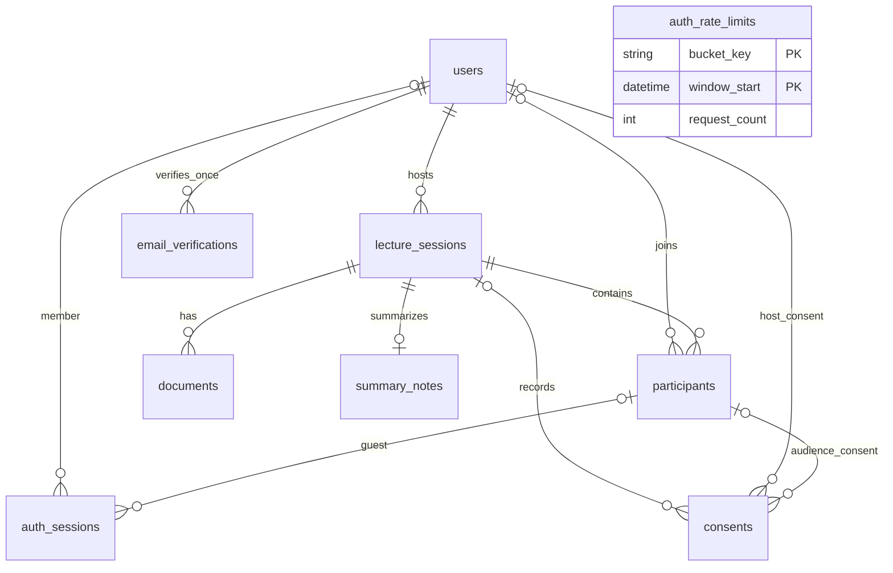
```mermaid
erDiagram
    users ||--o{ lecture_sessions : hosts
    users o|--o{ participants : joins
    users o|--o{ auth_sessions : member
    participants o|--o{ auth_sessions : guest
    lecture_sessions ||--o{ participants : contains
    lecture_sessions o|--o{ consents : records
    users o|--o{ consents : host_consent
    participants o|--o{ consents : audience_consent
    lecture_sessions ||--o{ documents : has
    lecture_sessions ||--o| summary_notes : summarizes
    users ||--o{ email_verifications : verifies_once
    auth_rate_limits {
        string bucket_key PK
        datetime window_start PK
        int request_count
    }
```

## diagram-02 학과 레지스트리 복사본과 서비스 후보 데이터

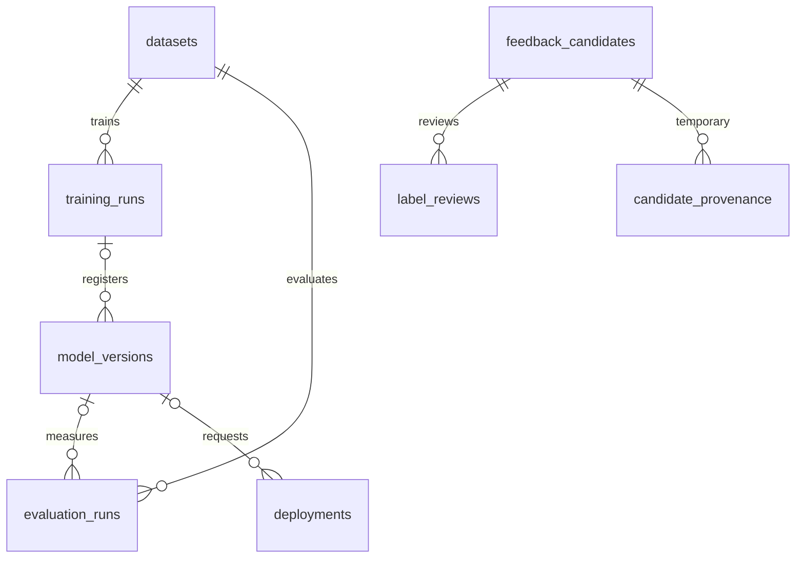
```mermaid
erDiagram
    datasets ||--o{ training_runs : trains
    training_runs o|--o{ model_versions : registers
    datasets ||--o{ evaluation_runs : evaluates
    model_versions o|--o{ evaluation_runs : measures
    model_versions o|--o{ deployments : requests
    feedback_candidates ||--o{ label_reviews : reviews
    feedback_candidates ||--o{ candidate_provenance : temporary
```

## diagram-03 서버 클라이언트 구조 및 인증 서버 분리

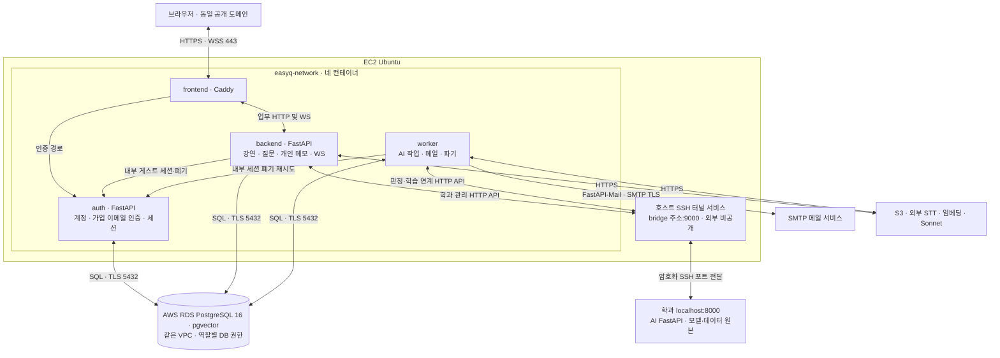
```mermaid
flowchart TB
 UI["브라우저 · 동일 공개 도메인"]
 subgraph EC2["EC2 Ubuntu"]
  subgraph NET["easyq-network · 네 컨테이너"]
   F["frontend · Caddy"]
   A["auth · FastAPI<br/>계정 · 가입 이메일 인증 · 세션"]
   B["backend · FastAPI<br/>강연 · 질문 · 개인 메모 · WS"]
   W["worker<br/>AI 작업 · 메일 · 파기"]
   F -->|"인증 경로"| A
   F <-->|"업무 HTTP 및 WS"| B
   B -->|"내부 게스트 세션·폐기"| A
   W -->|"내부 세션 폐기 재시도"| A
  end
  T["호스트 SSH 터널 서비스<br/>bridge 주소:9000 · 외부 비공개"]
  B <-->|"학과 관리 HTTP API"| T
  W <-->|"판정·학습 연계 HTTP API"| T
 end
 UI <-->|"HTTPS · WSS 443"| F
 DB[("AWS RDS PostgreSQL 16 · pgvector<br/>같은 VPC · 역할별 DB 권한")]
 A & B & W <-->|"SQL · TLS 5432"| DB
 T <-->|"암호화 SSH 포트 전달"| DEP["학과 localhost:8000<br/>AI FastAPI · 모델·데이터 원본"]
 W -->|"FastAPI-Mail · SMTP TLS"| MAIL["SMTP 메일 서비스"]
 B & W <-->|"HTTPS"| EXT["S3 · 외부 STT · 임베딩 · Sonnet"]
```

## diagram-04 Docker 컨테이너별 모듈 구성

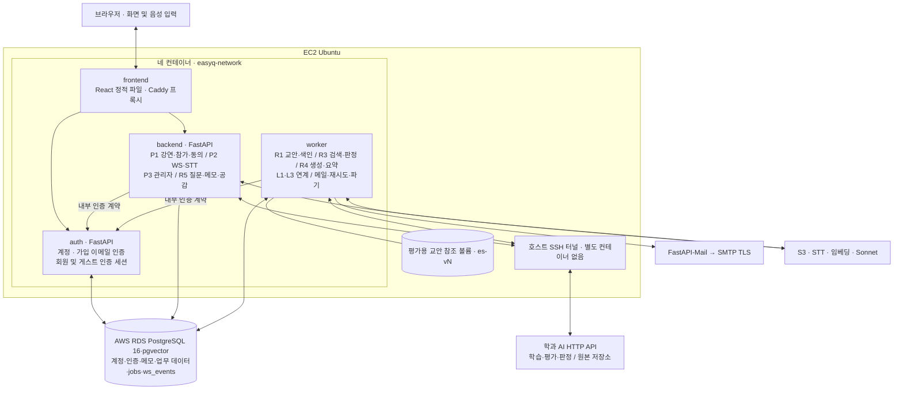
```mermaid
flowchart TB
 UI["브라우저 · 화면 및 음성 입력"]
 subgraph EC2["EC2 Ubuntu"]
  subgraph NET["네 컨테이너 · easyq-network"]
   F["frontend<br/>React 정적 파일 · Caddy 프록시"]
   A["auth · FastAPI<br/>계정 · 가입 이메일 인증<br/>회원 및 게스트 인증 세션"]
   B["backend · FastAPI<br/>P1 강연·참가·동의 / P2 WS·STT<br/>P3 관리자 / R5 질문·메모·공감"]
   W["worker<br/>R1 교안·색인 / R3 검색·판정 / R4 생성·요약<br/>L1·L3 연계 / 메일·재시도·파기"]
   F --> A & B
   B & W -->|"내부 인증 계약"| A
  end
  REF[("평가용 교안 참조 볼륨 · es-vN")]
  W --- REF
  T["호스트 SSH 터널 · 별도 컨테이너 없음"]
  B & W <--> T
 end
 UI <--> F
 DB[("AWS RDS PostgreSQL 16·pgvector<br/>계정·인증·메모·업무 데이터·jobs·ws_events")]
 A & B & W <--> DB
 T <--> DEP["학과 AI HTTP API<br/>학습·평가·판정 / 원본 저장소"]
 W --> MAIL["FastAPI-Mail → SMTP TLS"]
 B & W <--> EXT["S3 · STT · 임베딩 · Sonnet"]
```

## diagram-05 그림 3-2. 질문 상태 전이

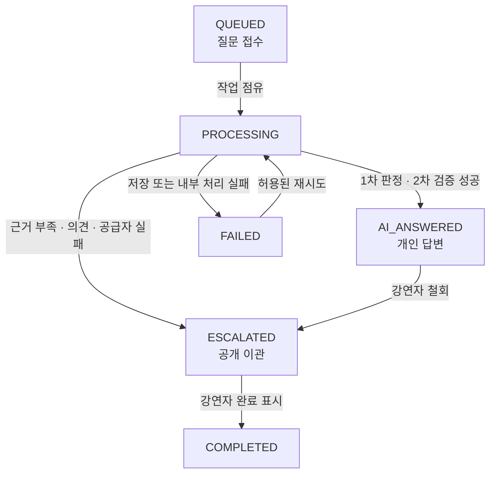
```mermaid
flowchart TB
    Q["QUEUED<br/>질문 접수"] -->|"작업 점유"| P["PROCESSING"]
    P -->|"1차 판정 · 2차 검증 성공"| A["AI_ANSWERED<br/>개인 답변"]
    P -->|"근거 부족 · 의견 · 공급자 실패"| E["ESCALATED<br/>공개 이관"]
    P -->|"저장 또는 내부 처리 실패"| F["FAILED"]
    F -->|"허용된 재시도"| P
    A -->|"강연자 철회"| E
    E -->|"강연자 완료 표시"| C["COMPLETED"]
```

## diagram-06 회원가입 시 한 번의 이메일 인증

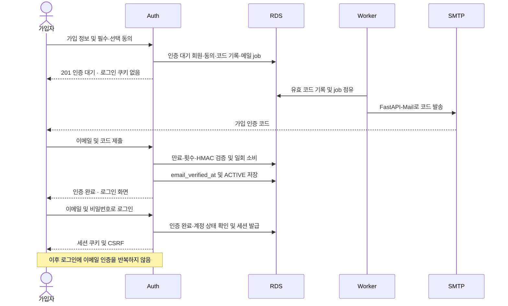
```mermaid
sequenceDiagram
 actor U as 가입자
 participant A as Auth
 participant D as RDS
 participant W as Worker
 participant M as SMTP
 U->>A: 가입 정보 및 필수·선택 동의
 A->>D: 인증 대기 회원·동의·코드 기록·메일 job
 A-->>U: 201 인증 대기 · 로그인 쿠키 없음
 W->>D: 유효 코드 기록 및 job 점유
 W->>M: FastAPI-Mail로 코드 발송
 M-->>U: 가입 인증 코드
 U->>A: 이메일 및 코드 제출
 A->>D: 만료·횟수·HMAC 검증 및 일회 소비
 A->>D: email_verified_at 및 ACTIVE 저장
 A-->>U: 인증 완료 · 로그인 화면
 U->>A: 이메일 및 비밀번호로 로그인
 A->>D: 인증 완료·계정 상태 확인 및 세션 발급
 A-->>U: 세션 쿠키 및 CSRF
 Note over U,A: 이후 로그인에 이메일 인증을 반복하지 않음
```

## diagram-07 강연 생성과 교안 처리

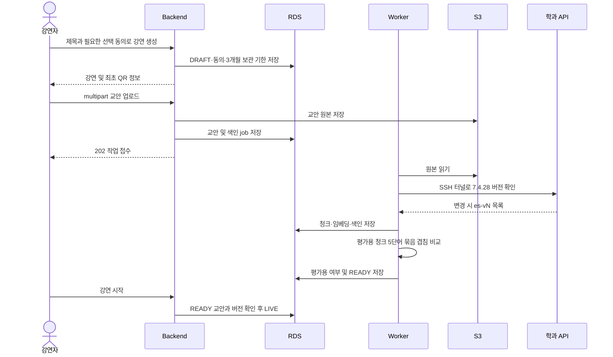
```mermaid
sequenceDiagram
 actor H as 강연자
 participant B as Backend
 participant D as RDS
 participant W as Worker
 participant S as S3
 participant T as 학과 API
 H->>B: 제목과 필요한 선택 동의로 강연 생성
 B->>D: DRAFT·동의·3개월 보관 기한 저장
 B-->>H: 강연 및 최초 QR 정보
 H->>B: multipart 교안 업로드
 B->>S: 교안 원본 저장
 B->>D: 교안 및 색인 job 저장
 B-->>H: 202 작업 접수
 W->>S: 원본 읽기
 W->>T: SSH 터널로 7.4.28 버전 확인
 T-->>W: 변경 시 es-vN 목록
 W->>D: 청크·임베딩·색인 저장
 W->>W: 평가용 청크 5단어 묶음 겹침 비교
 W->>D: 평가용 여부 및 READY 저장
 H->>B: 강연 시작
 B->>D: READY 교안과 버전 확인 후 LIVE
```

## diagram-08 QR 회원 및 게스트 입장

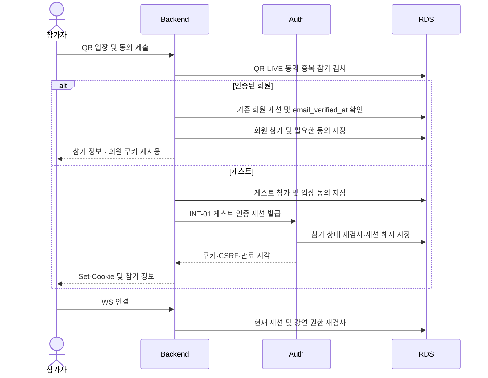
```mermaid
sequenceDiagram
 actor U as 참가자
 participant B as Backend
 participant A as Auth
 participant D as RDS
 U->>B: QR 입장 및 동의 제출
 B->>D: QR·LIVE·동의·중복 참가 검사
 alt 인증된 회원
  B->>D: 기존 회원 세션 및 email_verified_at 확인
  B->>D: 회원 참가 및 필요한 동의 저장
  B-->>U: 참가 정보 · 회원 쿠키 재사용
 else 게스트
  B->>D: 게스트 참가 및 입장 동의 저장
  B->>A: INT-01 게스트 인증 세션 발급
  A->>D: 참가 상태 재검사·세션 해시 저장
  A-->>B: 쿠키·CSRF·만료 시각
  B-->>U: Set-Cookie 및 참가 정보
 end
 U->>B: WS 연결
 B->>D: 현재 세션 및 강연 권한 재검사
```

## diagram-09 음성 전송과 색인

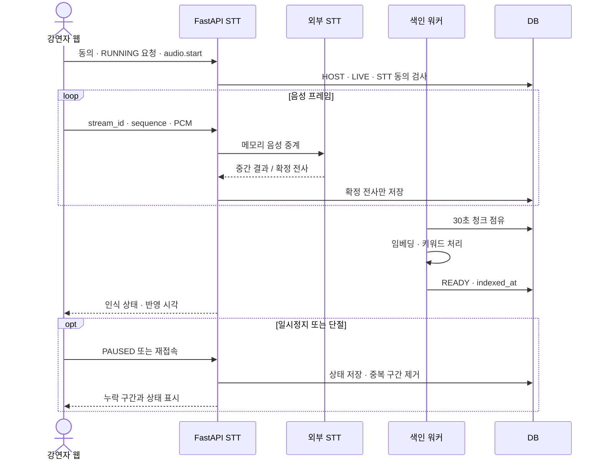
```mermaid
sequenceDiagram
    actor C as 강연자 웹
    participant A as FastAPI STT
    participant E as 외부 STT
    participant W as 색인 워커
    participant D as DB
    C->>A: 동의 · RUNNING 요청 · audio.start
    A->>D: HOST · LIVE · STT 동의 검사
    loop 음성 프레임
    C->>A: stream_id · sequence · PCM
    A->>E: 메모리 음성 중계
    E-->>A: 중간 결과 / 확정 전사
    A->>D: 확정 전사만 저장
    end
    W->>D: 30초 청크 점유
    W->>W: 임베딩 · 키워드 처리
    W->>D: READY · indexed_at
    A-->>C: 인식 상태 · 반영 시각
    opt 일시정지 또는 단절
    C->>A: PAUSED 또는 재접속
    A->>D: 상태 저장 · 중복 구간 제거
    A-->>C: 누락 구간과 상태 표시
    end
```

## diagram-10 유사 질문과 공감

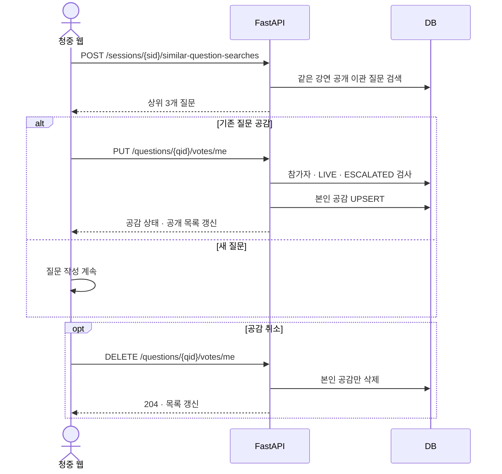
```mermaid
sequenceDiagram
    actor C as 청중 웹
    participant A as FastAPI
    participant D as DB
    C->>A: POST /sessions/{sid}/similar-question-searches
    A->>D: 같은 강연 공개 이관 질문 검색
    A-->>C: 상위 3개 질문
    alt 기존 질문 공감
    C->>A: PUT /questions/{qid}/votes/me
    A->>D: 참가자 · LIVE · ESCALATED 검사
    A->>D: 본인 공감 UPSERT
    A-->>C: 공감 상태 · 공개 목록 갱신
    else 새 질문
    C->>C: 질문 작성 계속
    end
    opt 공감 취소
    C->>A: DELETE /questions/{qid}/votes/me
    A->>D: 본인 공감만 삭제
    A-->>C: 204 · 목록 갱신
    end
```

## diagram-11 질문 판정과 답변

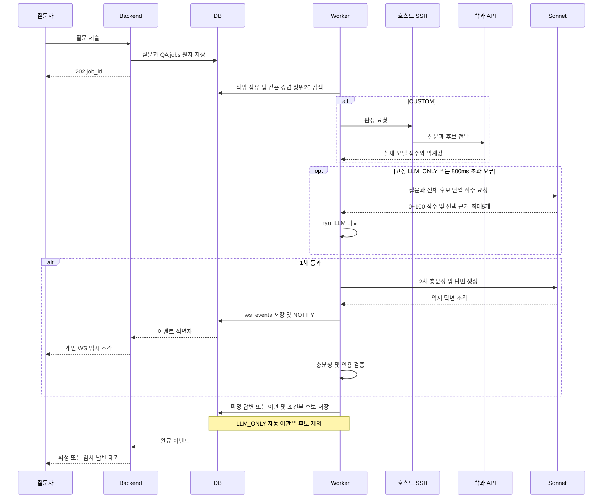
```mermaid
sequenceDiagram
    participant U as 질문자
    participant B as Backend
    participant D as DB
    participant W as Worker
    participant T as 호스트 SSH
    participant A as 학과 API
    participant L as Sonnet
    U->>B: 질문 제출
    B->>D: 질문과 QA jobs 원자 저장
    B-->>U: 202 job_id
    W->>D: 작업 점유 및 같은 강연 상위20 검색
    alt CUSTOM
      W->>T: 판정 요청
      T->>A: 질문과 후보 전달
      A-->>W: 실제 모델 점수와 임계값
    end
    opt 고정 LLM_ONLY 또는 800ms 초과 오류
      W->>L: 질문과 전체 후보 단일 점수 요청
      L-->>W: 0~100 점수 및 선택 근거 최대5개
      W->>W: tau_LLM 비교
    end
    alt 1차 통과
      W->>L: 2차 충분성 및 답변 생성
      L-->>W: 임시 답변 조각
      W->>D: ws_events 저장 및 NOTIFY
      D-->>B: 이벤트 식별자
      B-->>U: 개인 WS 임시 조각
      W->>W: 충분성 및 인용 검증
    end
    W->>D: 확정 답변 또는 이관 및 조건부 후보 저장
    Note over W,D: LLM_ONLY 자동 이관은 후보 제외
    D-->>B: 완료 이벤트
    B-->>U: 확정 또는 임시 답변 제거
```

## diagram-12 강연자 검토 철회 완료

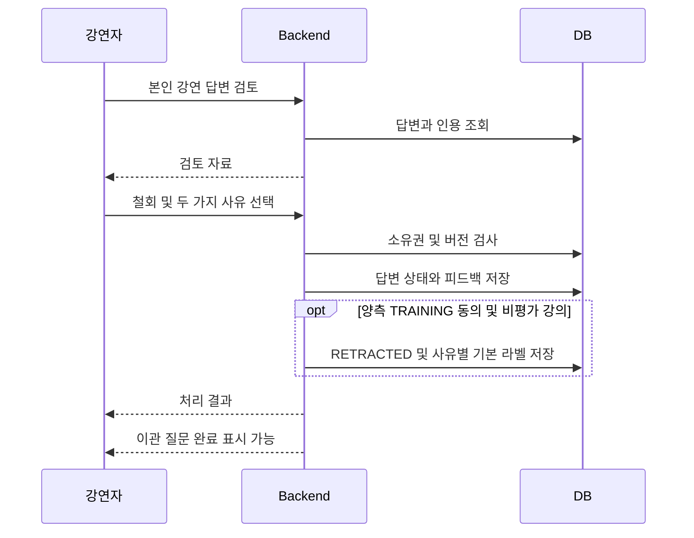
```mermaid
sequenceDiagram
    participant H as 강연자
    participant B as Backend
    participant D as DB
    H->>B: 본인 강연 답변 검토
    B->>D: 답변과 인용 조회
    B-->>H: 검토 자료
    H->>B: 철회 및 두 가지 사유 선택
    B->>D: 소유권 및 버전 검사
    B->>D: 답변 상태와 피드백 저장
    opt 양측 TRAINING 동의 및 비평가 강의
      B->>D: RETRACTED 및 사유별 기본 라벨 저장
    end
    B-->>H: 처리 결과
    B-->>H: 이관 질문 완료 표시 가능
```

## diagram-13 종료 요약 및 기록

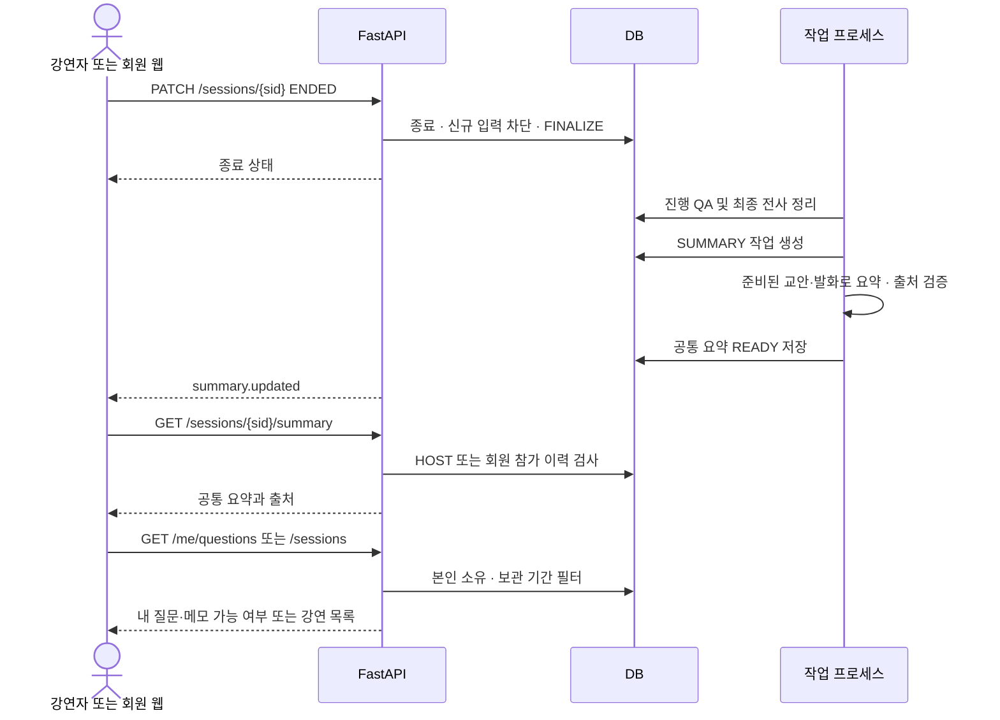
```mermaid
sequenceDiagram
    actor C as 강연자 또는 회원 웹
    participant A as FastAPI
    participant D as DB
    participant W as 작업 프로세스
    C->>A: PATCH /sessions/{sid} ENDED
    A->>D: 종료 · 신규 입력 차단 · FINALIZE
    A-->>C: 종료 상태
    W->>D: 진행 QA 및 최종 전사 정리
    W->>D: SUMMARY 작업 생성
    W->>W: 준비된 교안·발화로 요약 · 출처 검증
    W->>D: 공통 요약 READY 저장
    A-->>C: summary.updated
    C->>A: GET /sessions/{sid}/summary
    A->>D: HOST 또는 회원 참가 이력 검사
    A-->>C: 공통 요약과 출처
    C->>A: GET /me/questions 또는 /sessions
    A->>D: 본인 소유 · 보관 기간 필터
    A-->>C: 내 질문·메모 가능 여부 또는 강연 목록
```

## diagram-14 동의 철회와 파기

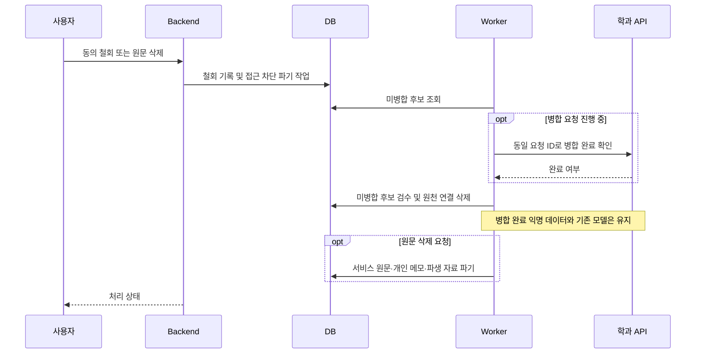
```mermaid
sequenceDiagram
    participant U as 사용자
    participant B as Backend
    participant D as DB
    participant W as Worker
    participant A as 학과 API
    U->>B: 동의 철회 또는 원문 삭제
    B->>D: 철회 기록 및 접근 차단 파기 작업
    W->>D: 미병합 후보 조회
    opt 병합 요청 진행 중
      W->>A: 동일 요청 ID로 병합 완료 확인
      A-->>W: 완료 여부
    end
    W->>D: 미병합 후보 검수 및 원천 연결 삭제
    Note over W,A: 병합 완료 익명 데이터와 기존 모델은 유지
    opt 원문 삭제 요청
      W->>D: 서비스 원문·개인 메모·파생 자료 파기
    end
    B-->>U: 처리 상태
```

## diagram-15 관리자 계정 정지와 강연 종료

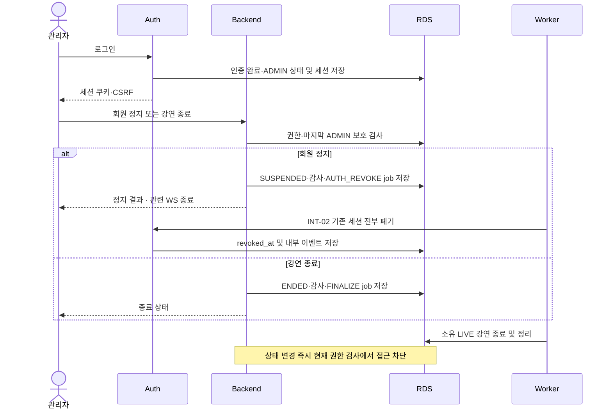
```mermaid
sequenceDiagram
 actor U as 관리자
 participant A as Auth
 participant B as Backend
 participant D as RDS
 participant W as Worker
 U->>A: 로그인
 A->>D: 인증 완료·ADMIN 상태 및 세션 저장
 A-->>U: 세션 쿠키·CSRF
 U->>B: 회원 정지 또는 강연 종료
 B->>D: 권한·마지막 ADMIN 보호 검사
 alt 회원 정지
  B->>D: SUSPENDED·감사·AUTH_REVOKE job 저장
  B-->>U: 정지 결과 · 관련 WS 종료
  W->>A: INT-02 기존 세션 전부 폐기
  A->>D: revoked_at 및 내부 이벤트 저장
 else 강연 종료
  B->>D: ENDED·감사·FINALIZE job 저장
  B-->>U: 종료 상태
 end
 W->>D: 소유 LIVE 강연 종료 및 정리
 Note over B,D: 상태 변경 즉시 현재 권한 검사에서 접근 차단
```

## diagram-16 후보 검수와 데이터셋 등록

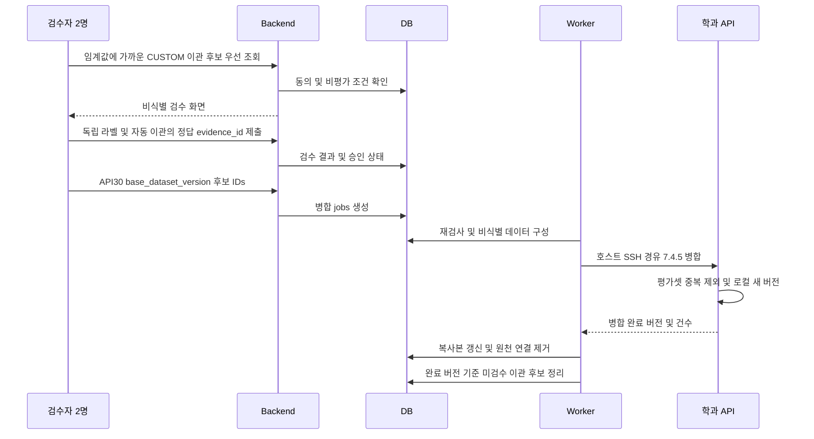
```mermaid
sequenceDiagram
    participant R as 검수자 2명
    participant B as Backend
    participant D as DB
    participant W as Worker
    participant A as 학과 API
    R->>B: 임계값에 가까운 CUSTOM 이관 후보 우선 조회
    B->>D: 동의 및 비평가 조건 확인
    B-->>R: 비식별 검수 화면
    R->>B: 독립 라벨 및 자동 이관의 정답 evidence_id 제출
    B->>D: 검수 결과 및 승인 상태
    R->>B: API30 base_dataset_version 후보 IDs
    B->>D: 병합 jobs 생성
    W->>D: 재검사 및 비식별 데이터 구성
    W->>A: 호스트 SSH 경유 7.4.5 병합
    A->>A: 평가셋 중복 제외 및 로컬 새 버전
    A-->>W: 병합 완료 버전 및 건수
    W->>D: 복사본 갱신 및 원천 연결 제거
    W->>D: 완료 버전 기준 미검수 이관 후보 정리
```

## diagram-17 학습 및 평가

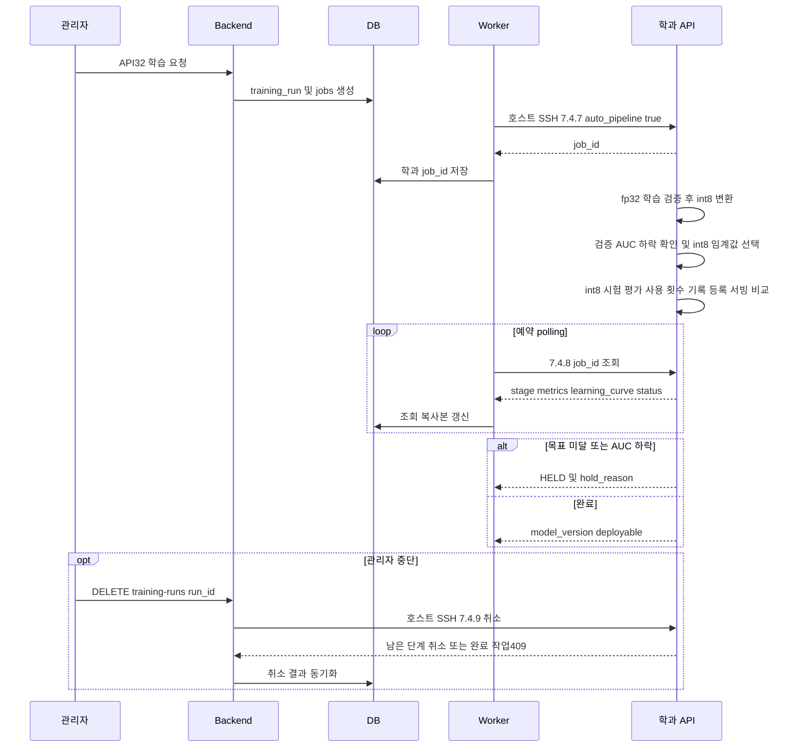
```mermaid
sequenceDiagram
    participant M as 관리자
    participant B as Backend
    participant D as DB
    participant W as Worker
    participant A as 학과 API
    M->>B: API32 학습 요청
    B->>D: training_run 및 jobs 생성
    W->>A: 호스트 SSH 7.4.7 auto_pipeline true
    A-->>W: job_id
    W->>D: 학과 job_id 저장
    A->>A: fp32 학습 검증 후 int8 변환
    A->>A: 검증 AUC 하락 확인 및 int8 임계값 선택
    A->>A: int8 시험 평가 사용 횟수 기록 등록 서빙 비교
    loop 예약 polling
      W->>A: 7.4.8 job_id 조회
      A-->>W: stage metrics learning_curve status
      W->>D: 조회 복사본 갱신
    end
    alt 목표 미달 또는 AUC 하락
      A-->>W: HELD 및 hold_reason
    else 완료
      A-->>W: model_version deployable
    end
    opt 관리자 중단
      M->>B: DELETE training-runs run_id
      B->>A: 호스트 SSH 7.4.9 취소
      A-->>B: 남은 단계 취소 또는 완료 작업409
      B->>D: 취소 결과 동기화
    end
```

## diagram-18 버전 배포와 롤백

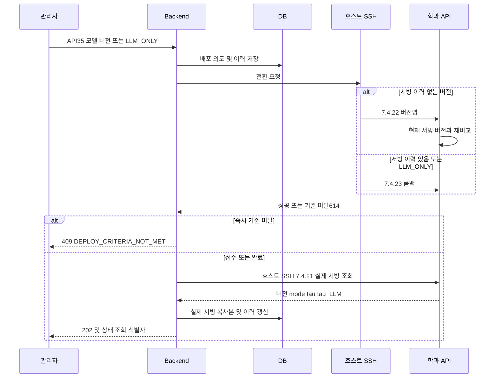
```mermaid
sequenceDiagram
    participant M as 관리자
    participant B as Backend
    participant D as DB
    participant T as 호스트 SSH
    participant A as 학과 API
    M->>B: API35 모델 버전 또는 LLM_ONLY
    B->>D: 배포 의도 및 이력 저장
    B->>T: 전환 요청
    alt 서빙 이력 없는 버전
      T->>A: 7.4.22 버전명
      A->>A: 현재 서빙 버전과 재비교
    else 서빙 이력 있음 또는 LLM_ONLY
      T->>A: 7.4.23 롤백
    end
    A-->>B: 성공 또는 기준 미달614
    alt 즉시 기준 미달
      B-->>M: 409 DEPLOY_CRITERIA_NOT_MET
    else 접수 또는 완료
      B->>A: 호스트 SSH 7.4.21 실제 서빙 조회
      A-->>B: 버전 mode tau tau_LLM
      B->>D: 실제 서빙 복사본 및 이력 갱신
      B-->>M: 202 및 상태 조회 식별자
    end
```

## diagram-19 모니터링과 피드백 순환

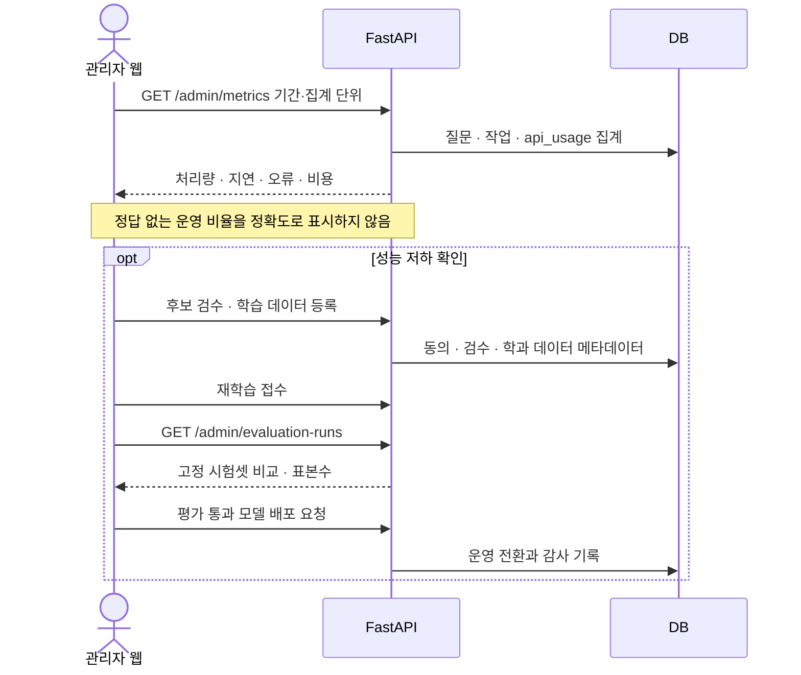
```mermaid
sequenceDiagram
    actor C as 관리자 웹
    participant A as FastAPI
    participant D as DB
    C->>A: GET /admin/metrics 기간·집계 단위
    A->>D: 질문 · 작업 · api_usage 집계
    A-->>C: 처리량 · 지연 · 오류 · 비용
    Note over A,C: 정답 없는 운영 비율을 정확도로 표시하지 않음
    opt 성능 저하 확인
    C->>A: 후보 검수 · 학습 데이터 등록
    A->>D: 동의 · 검수 · 학과 데이터 메타데이터
    C->>A: 재학습 접수
    C->>A: GET /admin/evaluation-runs
    A-->>C: 고정 시험셋 비교 · 표본수
    C->>A: 평가 통과 모델 배포 요청
    A->>D: 운영 전환과 감사 기록
    end
```

## diagram-20 계정 관리와 인증 세션 폐기

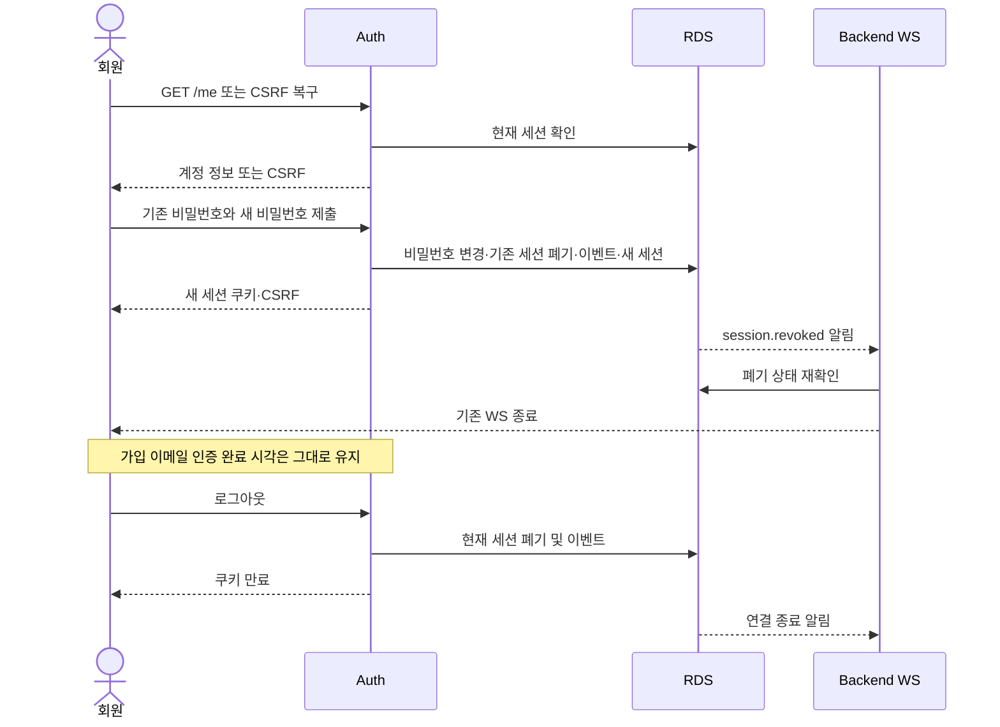
```mermaid
sequenceDiagram
 actor U as 회원
 participant A as Auth
 participant D as RDS
 participant B as Backend WS
 U->>A: GET /me 또는 CSRF 복구
 A->>D: 현재 세션 확인
 A-->>U: 계정 정보 또는 CSRF
 U->>A: 기존 비밀번호와 새 비밀번호 제출
 A->>D: 비밀번호 변경·기존 세션 폐기·이벤트·새 세션
 A-->>U: 새 세션 쿠키·CSRF
 D-->>B: session.revoked 알림
 B->>D: 폐기 상태 재확인
 B-->>U: 기존 WS 종료
 Note over U,A: 가입 이메일 인증 완료 시각은 그대로 유지
 U->>A: 로그아웃
 A->>D: 현재 세션 폐기 및 이벤트
 A-->>U: 쿠키 만료
 D-->>B: 연결 종료 알림
```

## diagram-21 청중 AI 답변 평가

```mermaid
sequenceDiagram
    participant U as 질문자
    participant B as Backend
    participant D as DB
    U->>B: PUT answer-feedback/me HELPFUL 또는 UNHELPFUL
    B->>D: 본인 ACTIVE 답변 확인
    B->>D: 평가 UPSERT
    opt 양측 TRAINING 동의 및 비평가 강의
      B->>D: AUDIENCE_HELPFUL 또는 AUDIENCE_UNHELPFUL 후보
    end
    B-->>U: 저장 결과
    Note over U,D: 평가만으로 답변 공개 또는 철회하지 않음
```

## diagram-22 질문과 답변 및 개인 메모 ERD

```mermaid
erDiagram
    lecture_sessions ||--o{ knowledge_chunks : scopes
    documents o|--o{ knowledge_chunks : supplies
    lecture_sessions ||--o{ questions : receives
    participants ||--o{ questions : asks
    documents o|--o{ questions : page_context
    model_versions o|--o{ questions : judges
    questions ||--o| answers : produces
    answers ||--o{ answer_citations : cites
    knowledge_chunks ||--o{ answer_citations : supports
    questions ||--o{ votes : receives
    participants ||--o{ votes : casts
    answers ||--o{ answer_feedback : evaluated
    participants ||--o{ answer_feedback : rates
    questions ||--o| question_notes : private_note
```

## diagram-23 검수와 계보 ERD

```mermaid
erDiagram
    questions ||--o{ candidate_provenance : traces
    answers o|--o{ candidate_provenance : traces
    users o|--o{ candidate_provenance : actor
    participants o|--o{ candidate_provenance : actor
    feedback_candidates ||--|| candidate_provenance : origin
    feedback_candidates ||--o{ label_reviews : reviewed
    users ||--o{ label_reviews : reviews
    users o|--o{ training_runs : requests
    users ||--o{ deployments : requests
    deployments o|--o{ deployments : previous
```

## diagram-24 작업과 운영 ERD

```mermaid
erDiagram
    lecture_sessions o|--o{ jobs : schedules
    users o|--o{ jobs : requests
    participants o|--o{ jobs : requests
    users o|--o{ audit_events : acts
    lecture_sessions o|--o{ api_usage : incurs
    questions o|--o{ api_usage : relates
    jobs o|--o{ ws_events : emits
    lecture_sessions o|--o{ ws_events : scopes
```

## diagram-25 나의 미답변 질문 개인 메모

```mermaid
sequenceDiagram
 actor U as 작성 회원
 participant B as Backend
 participant D as RDS
 U->>B: GET /me/questions
 B->>D: 본인·보관 기간·답변 상태 조회
 B-->>U: has_note 및 can_create_note
 U->>B: GET /me/questions/{id}/note
 B->>D: 질문 작성자 권한 검사
 B-->>U: Note 또는 null · ETag
 U->>B: PUT 메모 및 동시성 헤더
 B->>D: 질문·메모 잠금 및 소유권 검사
 alt 신규 작성
  B->>D: 최종 미답변 상태 확인 및 INSERT
 else 기존 수정
  B->>D: 메모 버전 확인 및 UPDATE
 end
 B-->>U: 저장된 메모와 새 ETag
 Note over B,D: 질문 상태 유지 · 공개 및 학습 데이터 제외
 U->>B: DELETE 메모 및 If-Match
 B->>D: 소유권·버전 검사 후 DELETE
 B-->>U: 204
```